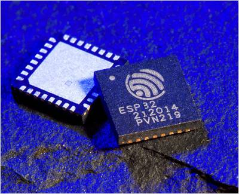

# labmicro
ข้อมูลการทดลองและสรุปผลการทดลองตั้งแต่1-4
------------------------------
- สรุปผลการทดลองที่1: การต่อวงจรและติดตั้งโปรแกรมบน Microcontroller ESP32
- สรุปผลการทดลองที่2: การแจ้งข้อมมู,ผ่านแอพพลิเคชัน line
- สรุปผลการทดลองที่3: การเชื่อมต่อกันระหว่าง MIcrocontroller
- สรุปผลการทดลองที่4: การนำ MIcrocontroller มาประยุกต์ใช้
------------------------------
[สรุปผลการทดลองที่1](https://drive.google.com/open?id=1frodUk8IMwz-5zqxLiugdcXcU3M4LGGu)

[สรุปผลการทดลองที่2](https://drive.google.com/open?id=1jsFH6ZACvoYk_KPQFBC2rJnd4frsl3Bb)

[สรุปผลการทดลองที่3](https://drive.google.com/open?id=149k0scD3YTKD6TzGCdRsr8j29bxbvJnS)

[สรุปผลการทดลองที่4](https://drive.google.com/open?id=1lE82yD3oSdr-PRoXp2wQEVGlS_aDAOof)

[วิธีการสร้าง Github](https://www.youtube.com/watch?v=husJ64dE8ls)

